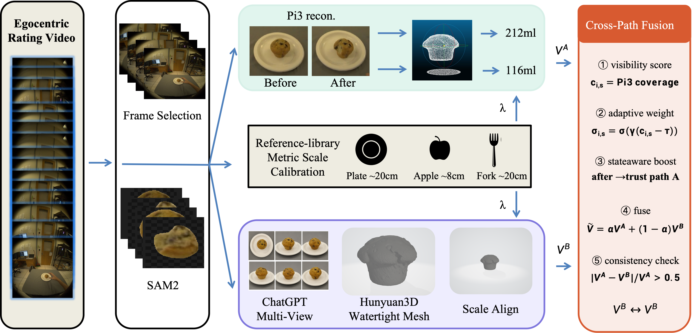

<div align="center">

<h1>CrossRecon</h1>

<h3>Dual-Path 3D Reconstruction and Cross-Validation for<br>Sparse-View Food Volume Measurement</h3>

<p>
  Wei Zhang<sup>1</sup>&nbsp;&nbsp;
  Shiqiang Gong<sup>1</sup>&nbsp;&nbsp;
  Songhua Li<sup>1</sup>&nbsp;&nbsp;
  Shengkai Yu<sup>1</sup>&nbsp;&nbsp;
  Yihang Wu<sup>1</sup>&nbsp;&nbsp;
  Zeyu Wang<sup>1</sup>&nbsp;&nbsp;
  Qiang Li<sup>1*</sup>&nbsp;&nbsp;
  Qi Wang<sup>1*</sup>
</p>

<p><sup>1</sup> Northwestern Polytechnical University &nbsp;&nbsp; <sup>*</sup> Corresponding authors</p>

<h2>🥈 2nd Place — CVPR 2026 MetaFood Workshop Challenge<br>on Continuous 3D Reconstruction While Eating</h2>

</div>

---

## Table of Contents

- [Introduction](#introduction)
- [Installation](#installation)
- [Submodules](#submodules)
- [Quick Start](#quick-start)
- [Outputs](#outputs)
- [Methodology](#methodology)
- [Results](#results)
- [Full Model Integration](#full-model-integration)
- [Tests](#tests)
- [Troubleshooting](#troubleshooting)
- [Citation](#citation)
- [Acknowledgements](#acknowledgements)

---

## Introduction

CrossRecon estimates before/after food volume and exports watertight meshes from egocentric eating videos. The pipeline combines a **real-observation path** with a **generative path**, then performs visibility-aware cross-path fusion for robust volume measurement.

### Highlights

- **Dual-path design.** Path A preserves observed eaten geometry; Path B supplies closed meshes from a generative shape prior.
- **Cross-path fusion.** Fuses both paths using visibility, state awareness, monotonicity, and consistency checks.
- **Metric scale calibration.** Recovers physical scale from plate/table-object priors.
- **Runnability first.** A deterministic `lite` backend runs without GPU, unpublished weights, or API keys.

### Framework

<p align="center">
  
</p>

---

## Installation

**Clone the repository:**

```bash
git clone https://github.com/your-org/CrossRecon.git
cd CrossRecon
```

**Option A — pip:**

```bash
pip install -r requirements.txt
```

**Option B — conda:**

```bash
conda env create -f environment.yml
conda activate crossrecon
```

**Editable install:**

```bash
pip install -e .
```

The `lite` backend requires only: `opencv-python`, `numpy`, `scipy`, `scikit-image`, `Pillow`, `PyYAML`.

---

## Submodules

The full model backend depends on the following external components:

1. **[Pi3](https://github.com/pablovela5620/mini-pi3)** — Feed-forward sparse-view geometry for Path A
2. **[GroundingDINO](https://github.com/IDEA-Research/GroundingDINO)** — Open-vocabulary food/plate/utensil detection
3. **[SAM2](https://github.com/facebookresearch/sam2)** — Segmentation masks for keyframes
4. **[GPT Image](https://platform.openai.com/docs/guides/images)** — Multi-view synthesis from a representative crop
5. **[Hunyuan3D](https://github.com/Tencent/Hunyuan3D-2)** — Watertight generative mesh reconstruction

> [!IMPORTANT]
> The default `lite` backend runs end-to-end without any of the above. Full reproduction of the submitted leaderboard numbers requires configuring all five components. See [Full Model Integration](#full-model-integration).

---

## Quick Start

**Run a single food item:**

```bash
python scripts/run_pipeline.py \
  --config configs/default.yaml \
  --video-dir data/videos \
  --items 1 \
  --output-dir outputs/demo_item1

python scripts/evaluate_outputs.py --output-dir outputs/demo_item1
```

**Run all 17 challenge videos:**

```bash
python scripts/run_pipeline.py \
  --config configs/default.yaml \
  --video-dir data/videos \
  --output-dir outputs/full_lite

python scripts/evaluate_outputs.py --output-dir outputs/full_lite
```

Expected output:

```
OK: 17 item(s), 34 mesh files checked.
```

---

## Outputs

```
outputs/full_lite/
├── volumes.csv
├── reports/
│   └── run_summary.json
├── meshes/
│   ├── 01_roasted_chicken_leg_before.obj
│   ├── 01_roasted_chicken_leg_after.obj
│   └── ...
└── debug/
    └── 01_roasted_chicken_leg/
        ├── before_mask.jpg
        └── after_mask.jpg
```

`volumes.csv` columns:

| Column | Description |
|---|---|
| `id` | Challenge food index |
| `food` | Food name parsed from video filename |
| `before_volume_ml` | Fused before-state volume |
| `after_volume_ml` | Fused after-state volume |
| `consumption_ratio` | `(before − after) / before` |
| `*_path_a_ml` | Path A volume estimate |
| `*_path_b_ml` | Path B volume estimate |
| `*_coverage` | Visibility proxy used by the fusion module |

---

## Methodology

### Path A — Real-Observation Reconstruction

Selected before/after keyframes are segmented with GroundingDINO + SAM2, passed to Pi3 for feed-forward geometry, aligned to the plate/support plane, and converted into a height-field mesh. This path is trusted for volume because it follows the actually consumed food geometry.

The `lite` backend approximates this path with deterministic frame sampling, classical segmentation, and height-field mesh generation.

### Path B — Generative Reconstruction

A representative food crop is synthesized into additional views via GPT Image, then reconstructed into a watertight mesh by Hunyuan3D. This path is trusted for closed topology, but can over-complete after-consumption food due to the generative prior favoring complete objects.

The `lite` backend approximates this path with a closed parametric mesh prior.

### Cross-Path Fusion

```
V_final = α × V_A + (1 − α) × V_B
```

`α` increases when Path A has better visibility coverage, and is boosted in the after state to reduce generative over-completion. A monotonicity guard ensures after-volume never exceeds before-volume.

---

## Results

Official challenge results reported in our technical materials:

| Phase | Metric | Result |
|---|---|---|
| Phase I | Composite volume score | 0.37 |
| Phase II | Mean L1 Chamfer Distance | 8.39 |
| **Ranking** | **Final challenge rank** | **2nd place** |

Per-item reported values: [data/metadata/challenge_reported_results.csv](data/metadata/challenge_reported_results.csv)

> [!NOTE]
> Numbers in `outputs/full_lite/volumes.csv` are lite-backend sanity-check outputs. They confirm repository execution, not official competition accuracy.

---

## Full Model Integration

To switch from the `lite` backend to the full challenge backend:

1. Copy [configs/full_model_template.yaml](configs/full_model_template.yaml).
2. Fill in paths for Pi3, GroundingDINO, SAM2, and Hunyuan3D weights.
3. Set the GPT Image API credential via the configured environment variable.
4. Implement or import official inference code in:
   - `GroundingDINOSAM2Backend`
   - `Pi3GeometryBackend`
   - `GPTImageHunyuanBackend`
5. Set `pipeline.mode: full`.

Until model assets are supplied, full mode raises a clear configuration error. See [docs/model_integration.md](docs/model_integration.md).

---

## Tests

```bash
PYTEST_DISABLE_PLUGIN_AUTOLOAD=1 pytest -q
```

---

## Troubleshooting

| Symptom | Likely reason | Fix |
|---|---|---|
| `pipeline.mode: full` raises an error | Full-model weights/API not configured | Use `lite` mode or fill `full_model_template.yaml` |
| `pytest` fails importing external plugins | Local pytest plugin conflict | Run with `PYTEST_DISABLE_PLUGIN_AUTOLOAD=1` |
| Output meshes missing | Pipeline did not finish or wrong output dir | Rerun `run_pipeline.py` then `evaluate_outputs.py` |
| Lite numbers differ from report | Lite backend is a structural reproduction only | Load the full model stack once weights/API are available |

---

## Citation

```bibtex
@misc{crossrecon2026,
  title  = {CrossRecon: Dual-Path 3D Reconstruction and Cross-Validation for Sparse-View Food Volume Measurement},
  author = {Zhang, Wei and Gong, Shiqiang and Li, Songhua and Yu, Shengkai and Wu, Yihang and Li, Qiang and Wang, Qi},
  year   = {2026},
  note   = {2nd Place Solution, CVPR MetaFood Workshop Challenge on Continuous 3D Reconstruction While Eating}
}
```

---

## Acknowledgements

This work was conducted as part of the CVPR 2026 MetaFood Workshop Challenge on Continuous 3D Reconstruction While Eating. We thank the challenge organizers for providing the dataset and evaluation framework. The README structure follows previous MetaFood challenge solution releases, including [VolETA](https://github.com/GCVCG/VolETA-MetaFood) and [VolTex](https://github.com/GCVCG/VolTex).
